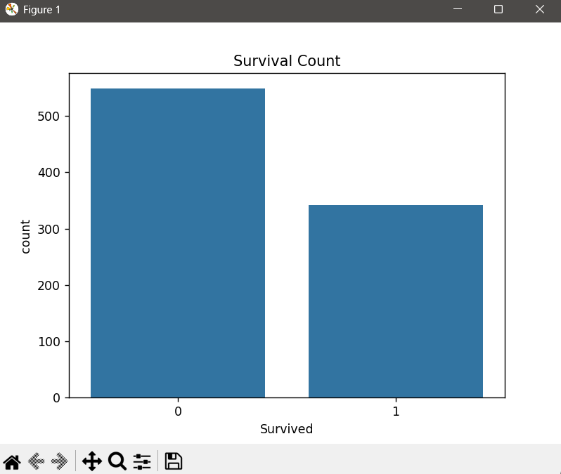

# Task 2 – Titanic Dataset EDA & Cleaning 🚢

This repository contains **Task 2** of my **Data Science Internship** at **Prodigy InfoTech** – July 2025 batch.

---

## 📌 Task Objective

Perform **Exploratory Data Analysis (EDA)** and **Data Cleaning** on the **Titanic dataset**. The aim is to explore the relationships between variables and discover trends & patterns.

---

## 🛠️ Tools Used

- Python
- Pandas
- Matplotlib
- Seaborn

---

## 🔎 Key Steps Performed

- Dataset inspection
- Handling missing values
- Dropping irrelevant columns
- Visualizations (Survival, Gender, Age, Pclass, etc.)
- Correlation heatmap

---

## 📁 Files Included

| File | Description |
|------|-------------|
| `task2.py` | Python code for EDA & cleaning |
| `titanic.csv` | Dataset used |
| `age.png`, `gender.png`, etc. | Graphs from analysis |

---

## 📊 Sample Output

---

## 🔗 Internship

This project is part of the **Data Science Internship** offered by [Prodigy InfoTech](https://prodigyinfotech.dev/).
